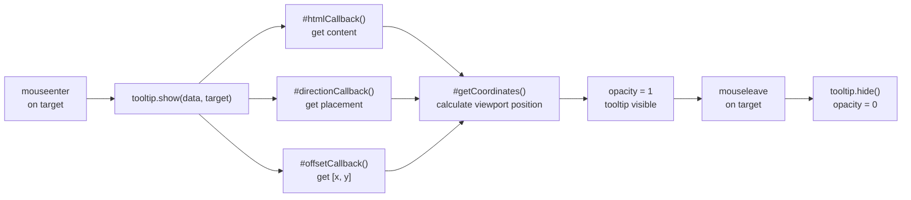

# tipviz

> A drop-in tooltip web component for data visualizations.

`tipviz` is a tiny, dependency-free Web Component that displays contextual information on hover. Drop `<tip-viz-tooltip>` anywhere in your page, configure it once, and reuse it across every chart element, table row, or UI node — no wrappers, no providers, no framework adapters needed.

---

## What problem it solves

Tooltip positioning in data visualizations is deceptively hard. You need to track viewport coordinates, scroll offsets, container boundaries, and flip direction when space runs out — all while keeping styles encapsulated. Most tooltip libraries either require a framework integration layer, bundle dozens ofKB you don't need, or leave positioning up to you.

`tipviz` handles all of that: it auto-positions itself relative to any target element, renders HTML content safely via `setHTML()`, and works inside React, Vue, Svelte, or plain HTML without a single adapter. The tooltip auto-moves to `document.body` so scroll and positioning work correctly even when you place it deep inside a component tree.

---

## How it works

1. Place `<tip-viz-tooltip>` in your HTML (anywhere — it auto-repositions to body)
2. Call `tooltip.setHtml()`, `tooltip.setDirection()`, `tooltip.setOffset()` once to configure
3. On hover, call `tooltip.show(data, targetElement)` — the component handles the rest
4. On leave, call `tooltip.hide()`

---

## Comparison

| Library | Bundle size | Framework | Positioning |
|---------|-----------|-----------|-------------|
| **tipviz** | ~3 KB | None — pure Web Component | Auto (8 directions + offsets) |
| **Tippy.js** | ~8 KB min+gzip | Optional adapter | Manual placement |
| **Floating UI** | ~14 KB | Optional | Auto with collision detection |

- **tipviz** — ideal when you want zero-dependency, framework-agnostic tooltips that just work in D3 charts or anywhere on the DOM. Positioning is directional rather than auto-flipping (tippy/floating-ui detect viewport edges).
- **Tippy.js** — a solid general-purpose library with rich animation support and a large plugin ecosystem. Requires an adapter if you want framework reactivity. Heavier than tipviz.
- **Floating UI** — the most powerful positioning engine with automatic collision detection and viewport flipping. Heavier (~14 KB), requires more configuration, and focuses purely on positioning rather than being a complete tooltip solution.

`tipviz` prioritizes simplicity and tiny footprint over auto-flipping and edge detection. If you need automatic viewport collision handling, reach for Floating UI. If you want a self-contained tooltip that installs in one import and works everywhere, tipviz is the choice.
