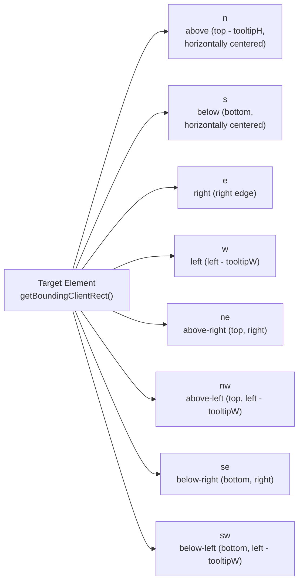
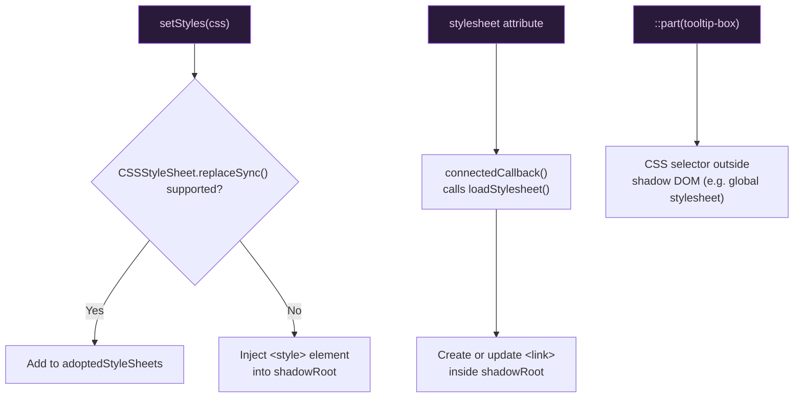

# tipviz — Component Workflow

## Positioning — Direction Mapping

```mermaid
flowchart LR
    T1["Target Element<br/>getBoundingClientRect()"]

    T1 --> N["n<br/>above (top - tooltipH,<br/>horizontally centered)"]
    T1 --> S["s<br/>below (bottom,<br/>horizontally centered)"]
    T1 --> E["e<br/>right (right edge)"]
    T1 --> W["w<br/>left (left - tooltipW)"]
    T1 --> NE["ne<br/>above-right (top, right)"]
    T1 --> NW["nw<br/>above-left (top, left - tooltipW)"]
    T1 --> SE["se<br/>below-right (bottom, right)"]
    T1 --> SW["sw<br/>below-left (bottom, left - tooltipW)"]

    class N fill:#1a3a2a,color:#e0f0e8,stroke:#4caf82
    class S fill:#1a3a2a,color:#e0f0e8,stroke:#4caf82
    class E fill:#1a3a2a,color:#e0f0e8,stroke:#4caf82
    class W fill:#1a3a2a,color:#e0f0e8,stroke:#4caf82
    class NE fill:#1a3a2a,color:#e0f0e8,stroke:#4caf82
    class NW fill:#1a3a2a,color:#e0f0e8,stroke:#4caf82
    class SE fill:#1a3a2a,color:#e0f0e8,stroke:#4caf82
    class SW fill:#1a3a2a,color:#e0f0e8,stroke:#4caf82
```

## Styling — Three Paths

```mermaid
flowchart TB
    S1["setStyles(css)"] --> S2{"CSSStyleSheet.replaceSync() supported?"}
    S2 -->|Yes| S3["Add to adoptedStyleSheets"]
    S2 -->|No| S4["Inject &lt;style&gt; element<br/>into shadowRoot"]

    A1["stylesheet attribute"] --> A2["connectedCallback()<br/>calls loadStylesheet()"]
    A2 --> A3["Create or update &lt;link&gt;<br/>inside shadowRoot"]

    P1["::part(tooltip-box)"] --> P2["CSS selector outside<br/>shadow DOM (e.g. global stylesheet)"]

    classDef STYLE fill:#2a1a3a,color:#e8d0f0,stroke:#9c5cf0
    class S1 STYLE
    class A1 STYLE
    class P1 STYLE
```
